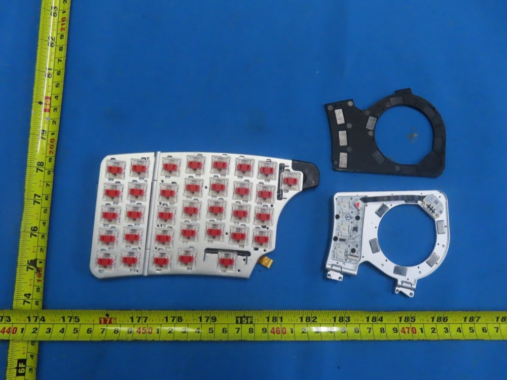
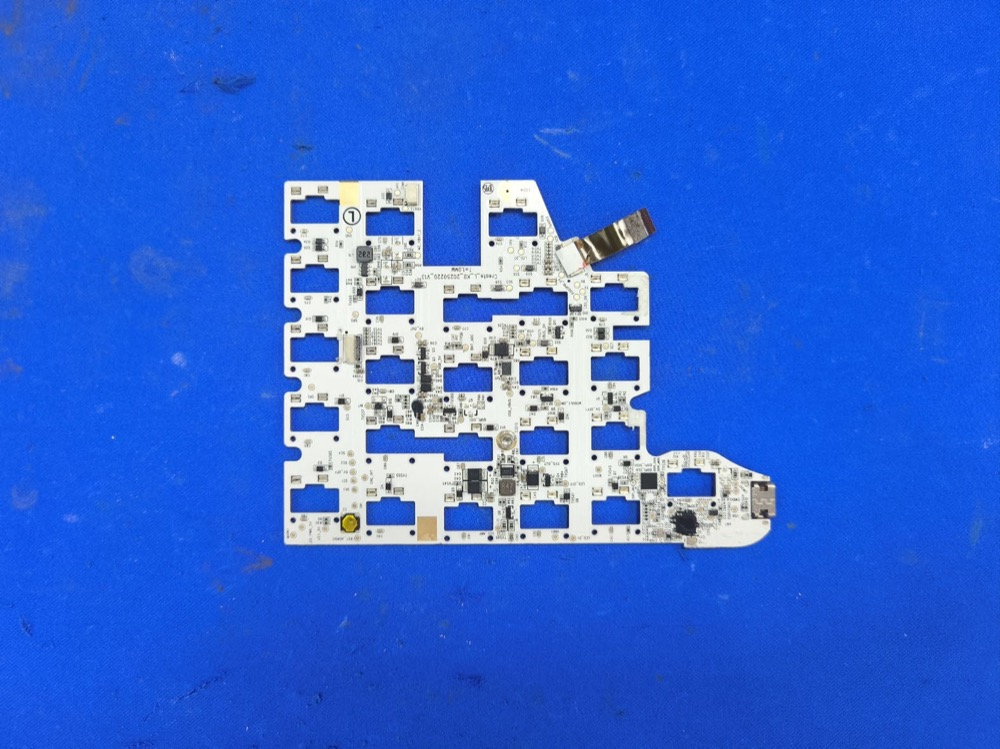
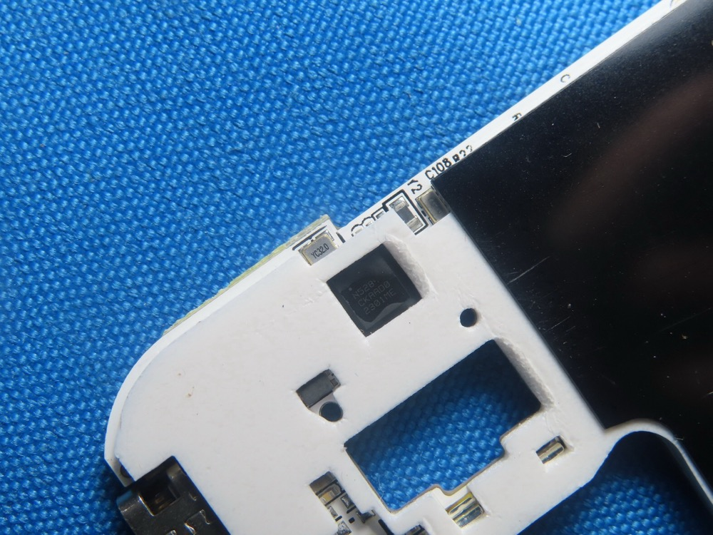
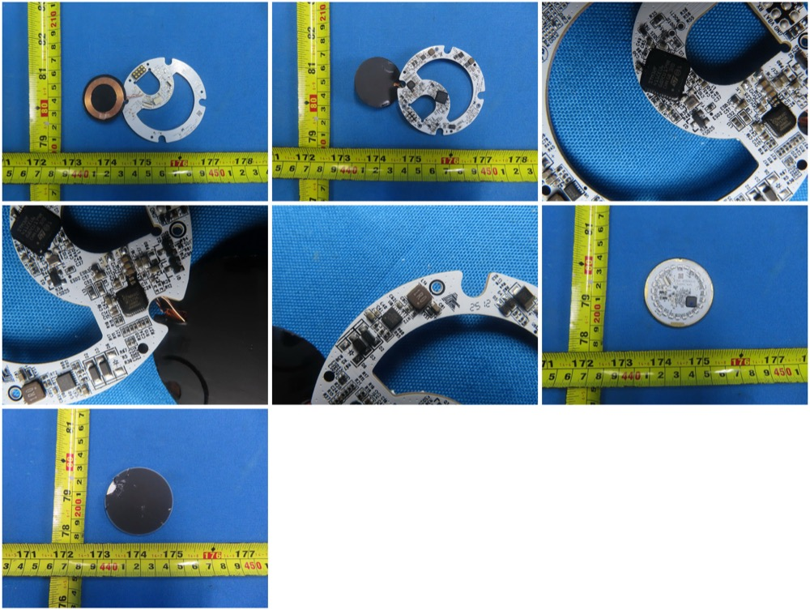

# Hardware deep dive

Consolidated from FCC filings (grantee **`2BQ4V`**: `0825CRL` left,
`0825CRR` right, `0825DG` dongle), USB/BLE probing, and the NayaCore
binary. Product family: halves `NAYA-800-1`, dongle `NAYA-100-1`.

## FCC filings (official source)

- **Official:** FCC OET Equipment Authorization search
  ([fcc.gov/oet/ea/fccid](https://www.fcc.gov/oet/ea/fccid)) —
  search Grantee Code **`2BQ4V`**. All PDFs below (test reports,
  internal/external photos, label, manuals, antenna specs, RF
  exposure) live there as exhibits.
- Mirror index (convenience, same exhibits):
  [0825CRL](https://fccid.io/2BQ4V0825CRL) ·
  [0825CRR](https://fccid.io/2BQ4V0825CRR) ·
  [0825DG](https://fccid.io/2BQ4V0825DG).
- Grant facts: issued **2025-08-29**, test firm BTL Inc (Dongguan),
  conducted output ~0.007 W (2.4 GHz DTS, Part 15C). Schematics, block
  diagram and operational description are **long-term confidential**
  (metadata only) — hence no public schematics.
- All photos on this page are FCC exhibits (internal/external photos),
  vendored here at reduced size; full-resolution originals are in the
  filings above.

## Halves

| Item | Value |
|---|---|
| BLE SoC | **Nordic nRF52811** (functional evidence: FCC 125 kbps S=8 coded-PHY tests pass; the nRF52810 lacks it. Marking reads `N5281?/CKAAD0/2301ME`) |
| USB MCU | **Unknown 2nd chip** — the nRF has no USB; halves expose CDC+HID; FW images are 226–360 KB ≫ 192 KB nRF flash |
| Boards | `Create_L_KB_20250220_V13` / `Create_R_KB_20250221_V13` (V0 `20230323` in early photos) |
| Switches | Kailh CPG-1232 low-profile |
| Base cells | FH301217 3.7 V **50 mAh** — hot-swap buffers, not the runtime source |
| Antenna | Dongguan Boen RF0400A PCB, 0.8 dBi |
| Radio | Bluetooth 5.4, 1M/2M/125k coded, up to +9 dBm. **No proprietary radio** (the SRD report is a 2nd BLE grant) |
| Debug | SWDIO/SWDCLK test points at the USB-C corner |
| USB | VID `0x37D1`, PID 100 (left) / 200 (right); CDC-Control + CDC-Data + HID |
| Toolchain | nRF Connect SDK 5.1.0 (`Naya_Temp_Flash_Pair.exe` in test reports) |

Each half is an independent BLE peripheral (HID over GATT + custom
`0x1234` service); the host (NayaCore) merges them. No radio link
between halves.

*Switch plate: red Kailh low-profile switches, circular module-bay
frames with dock magnets (FCC internal photos).*

*Full mainboard (`Create_L_KB_…_V13` silkscreen) — switch cutouts,
USB-C tail at right, central MCU zone (FCC internal photos).*

*SoC die marking confirms **nRF52811** (date code 2301 = Jan 2023);
32 MHz crystal alongside (FCC internal photos).*

### Biggest open hardware question

Identity + pinout of the **USB MCU** in the halves (the component side
of the V13 mainboard appears in no filing). Everything else needed for
a ZMK port is known — and Zephyr 3.7 in the bootloader confirms a ZMK
port is architecturally a board-def + driver exercise on the same nRF
Connect SDK generation.

## Modules (Track / Touch / Tune — plus two unreleased)

NayaCore references **five** `*_UserApp.sfb` images (+HASH each):
**Track, Tune, Touch, Float, Query**. Only the first three shipped.
`.sfb` files are NOT in the app bundle — they live in the base's
external SPI flash (LittleFS) and are flashed into modules **via
MCUBoot through the base** (`MCUBootWorker_CreateLeft_PortOne/Two_Module`).

| Item | Value |
|---|---|
| MCU | **STM32F411CEU6** (Cortex-M4F, 512 KB, USB OTG FS) on `Touch_MB 20250227 V10` |
| Touch frontend | SGMicro `4T523DF` |
| Charging | Qi receiver Maxic MT5705 (charging only — no data) |
| Link to base | **Wired pogo pins** (VBUS/USB on test pads) — no radio in modules |
| Power | Bidirectional (see [power](power.md)); packs ~600–1000 mAh (Track QS801630 1S2P 600 mAh, Touch FH202030 1000 mAh class) |
| Module FW | **0.2.3.3** (read live via `de/1008`) |
| Extras | Coin vibration motor (haptics), halo LED rings, dock magnets |
| Test pads | SWCLK / BOOT0 / BOOT1 broken out |

Gesture vocabulary per module (from NayaCore strings):

- **Track** — trackball (`track_up/down/left/right`, `horizontal/vertical`,
  `rotate`, `clockwise/counter_clockwise_rotate`) + **4 buttons**
  (`tap/double_tap/hold/press/tap_hold` on `button_1..4`).
- **Tune** — dial (`rotate`, `clockwise/counter_clockwise_rotate`) +
  touch surface, 1–4 fingers
  (`tap/double_tap/swipe_*/horizontal/vertical/pinch/spread`).
- **Touch** — touchpad, 1–4 finger gestures (`tap/double_tap/swipe_*/…`,
  `pinch/spread/pinch&spread` for 2 fingers).
- **Float (UNRELEASED)** — dial (`clockwise/anti_clockwise/rotation`) +
  **3D nav** (`rotation_x/y/z`, `translation_x/y/z`) — a spatial/3D-mouse module.
- **Query (UNRELEASED)** — no input gestures at all → almost certainly
  output-only (display?).

*Module ring PCB: Qi receiver coil, charge/control electronics and
close-ups of the module-side components (FCC internal photos).*

## Dongle (NAYA-100-1, “Speedlink”)

nRF52840 (`CKAAD0 2301ME`), board `BOK17_Dongle 20241106 V01`, USB-A,
Boen RF0401A antenna, SWDIO/TP1/TP2 broken out. Plain Bluetooth 5.4,
not proprietary 2.4 GHz.

*Dongle close-up — note the labeled **SWDIO/SWDCLK** pads next to the
USB connector: the custom-firmware entry in hardware (FCC internal
photos).*

## Supply chain

ODM: Dongguan Boen Intelligent Technology. Label: 5 V ⎓ 1.5 A,
Naya B.V. Wasaweg 3, Groningen. Certs: FCC 2BQ4V, IC 34320,
Japan 219-257016, Korea R-R-NBv-0825CRR.
