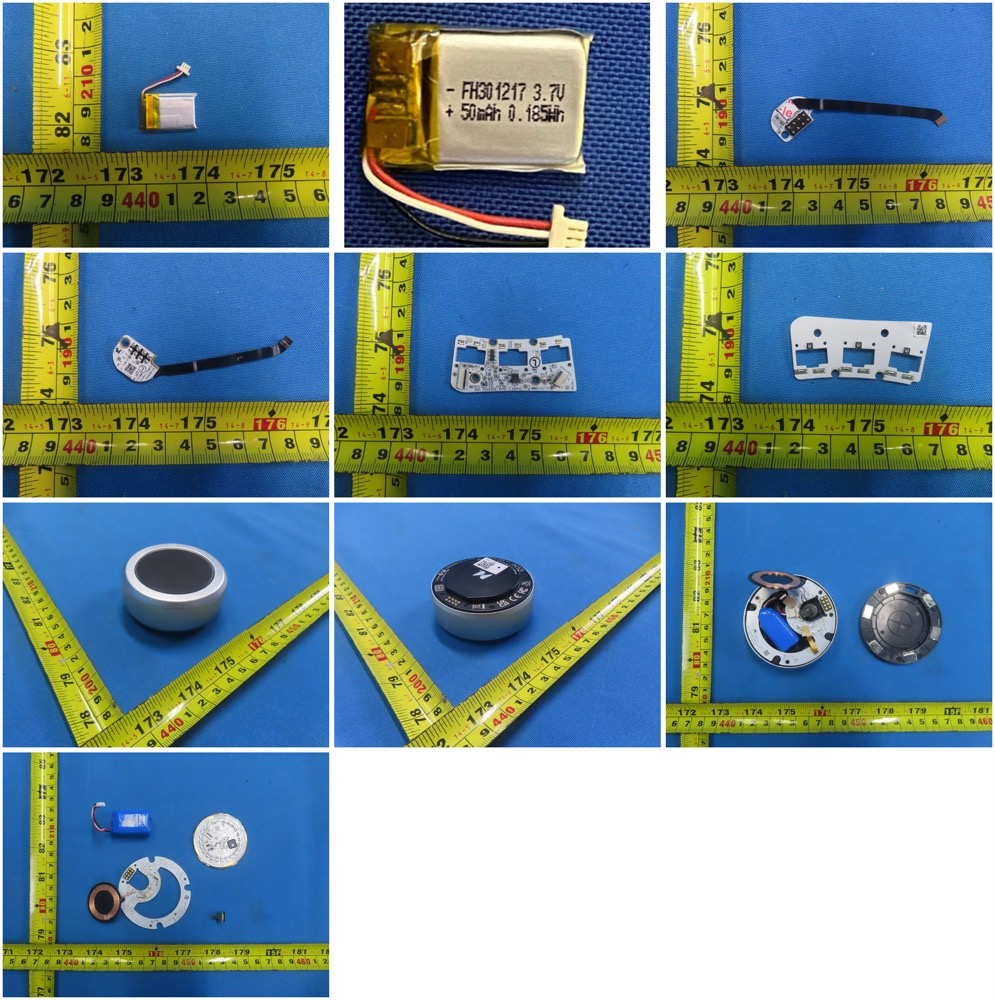

# Power architecture

Power flows **both ways** over the module pogo pins (user-confirmed):

- **Plugged in (USB):** USB → half → docked module (base charges module).
- **Off USB:** docked module → half (the big module pack powers the half).

The 50 mAh base cells (FH301217) are **hot-swap buffers** — they keep a
half alive while you swap modules, they are not the runtime source.

*FCC teardown sheet — top-middle cell reads `FH301217 3.7V 50mAh
0.185Wh` (the buffer); bottom row shows an opened module with the big
blue pack and the copper Qi coil (FCC internal photos).*

## Consequences (all verified live)

- **Discharge tests:** unplugged + docked drains the big module packs
  slowly. To sag the *base* cells, **undock the modules** overnight.
- **“True cold boot”** (the only real MCU reset besides `ee/10ce`):
  USB out **+** modules undocked **+** on/off switches. Flipping the
  switch with USB plugged in is NOT a reset (proven in the boot-trap era).
- **Module battery % is host-computed**, not on the wire:
  `de/100b` payload `[00, HI, LO, 00]` = module-rail voltage in **millivolts**
  (big-endian). NayaFlow maps it to % with calibration ≈
  4222 mV→100 %, 3910 mV→67 %, 3709 mV→45 % (~9.3 mV/% in that region).
  Samples: full Touch `0x1064`=4196 (app showed 4222), discharged Track
  `0x0E82`=3714 (app 3709) — within charging drift.
- **Base voltage candidate:** `fe/1006` bytes[1..2] big-endian mV
  (dumps read ~4088 left / ~4087 right; screenshots 4091/4098 later —
  drift direction consistent with USB charging).
- **Empty-dock quirk:** with no module, right reports `de/100b` zeros
  while left floats at ~`0x1060` (charger rail unloaded). Use `de/1001`
  byte1 as the true presence flag, never `de/100b`.

## Rails at a glance (healthy board, USB)

| Source | Value |
|---|---|
| Module rail (`de/100b`) | ~4200 mV full, ~3700 mV low |
| Base rail (`fe/1006`) | ~4090 mV, rises on USB charge |
| Module FW / base FW | 0.2.3.3 / 0.3.41.0 |
| Base cells | 50 mAh buffers only |
| Module packs | ~600–1000 mAh (the real batteries) |
