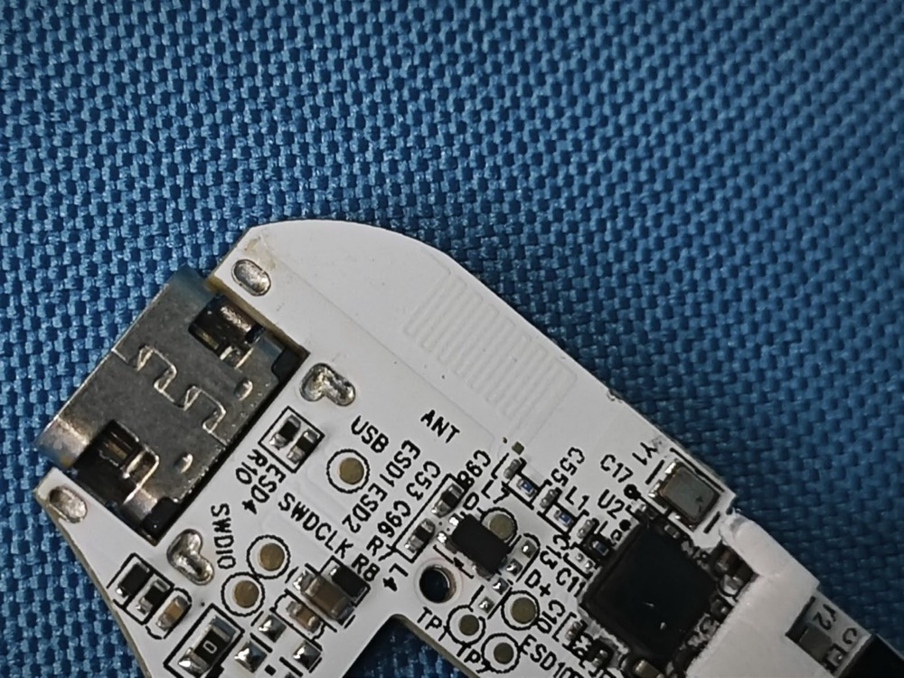

# ZMK port feasibility (assessment)

Honest status: **nobody has done it**. This page collects what the
bench proves helps a port, what blocks it, and what is still unknown —
so a future porter starts from facts, not guesses.

## Why a port is plausible

- **Home-turf SoC:** both halves run Nordic nRF52811 — the nRF52 family
  ZMK is built for.
- **Same SDK generation:** the stock firmware is Zephyr 3.7-based (see
  [Bootloader](bootloader.md)). A ZMK port is architecturally a
  board definition + driver exercise on the same nRF Connect SDK
  generation, not a foreign-platform bring-up.
- **SWD pads are labeled** on the PCB — the custom-firmware entry
  exists in hardware (see the dongle close-up in
  [Hardware](../device/hardware.md#dongle-naya-100-1-speedlink)).

- **Stock images are carved** and inventoried (see
  [Version inventory](versions.md)) — there is a return path via SWD.
- **Full behavior reference:** the entire wire protocol (keymap
  records, LED maps, settings, module config) is documented in this
  KB — the porter knows exactly what the stock FW does.

## What blocks it

- **Signed + encrypted bootloader** (RSA-2048). The stock bootloader
  rejects anything not signed by Naya's private key, and the company
  is defunct — no keys, no DFU path. Only **SWD erase + full custom
  build** (see [Signing](signing.md)).
- **Tight SoC:** nRF52811 has 192 KB flash / 24 KB RAM. ZMK targets
  bigger siblings (52840-class); only a stripped-down feature set
  fits, if at all. This is the single biggest technical risk.
- **Unknown USB MCU:** the component side of the V13 mainboard appears
  in no filing — identity and pinout of the USB MCU in the halves are
  unknown (see [Hardware](../device/hardware.md)).

## Still unknown (drivers to write blind)

- Key-matrix scan wiring and the LED driver chain.
- The split-link radio protocol between halves (plus the left-proxies-
  right host topology — see [Transport](../protocol/transport.md)).
- Module radios and the pogo-pin protocol (power flows both ways;
  data protocol undocumented).
- Battery-gauge calibration (host-computed from `de/100b` millivolts).

## Verdict

A minimal ZMK build (keys + basic split, no modules, no per-key RGB
effects) is **conceivable** for someone with nRF/Zephyr board-bring-up
experience and a SWD probe. A full-featured port (modules, LED engine,
power management) requires reverse-engineering several undocumented
subsystems first. Start with the [disassembly](../disassembly/index.md)
archive and the [command map](../protocol/commands.md).
